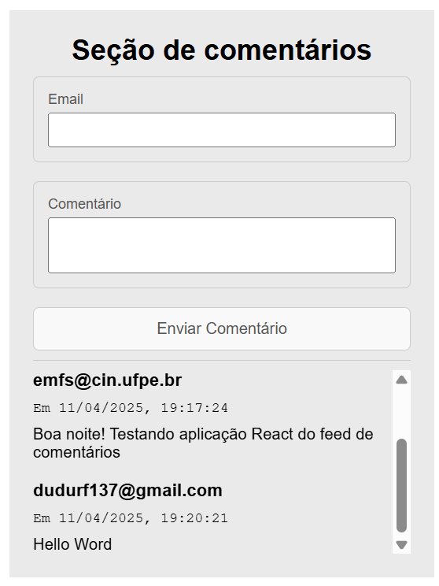
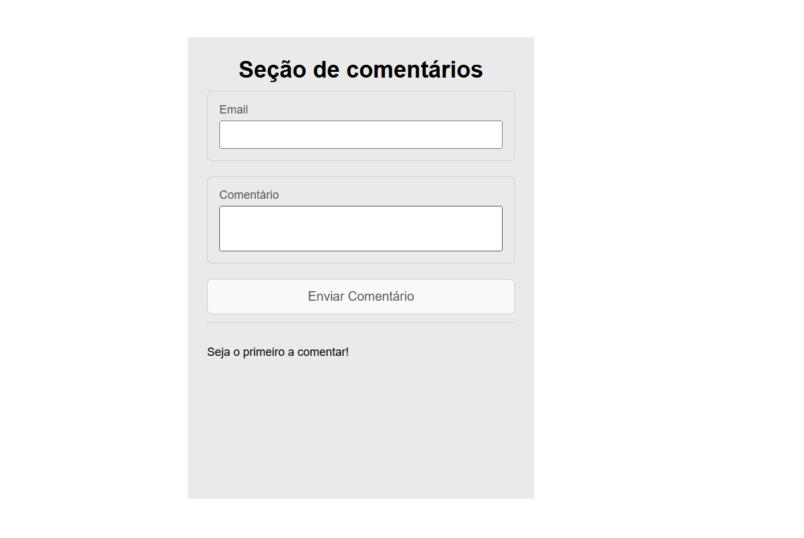

# Simple Comment Feed

Este é um projeto simples de um feed de comentários, desenvolvido para demonstrar o uso do **LocalStorage** no navegador. A aplicação permite que os usuários insiram um e-mail e um comentário, que são armazenados localmente e exibidos em uma lista.

## Funcionalidades

- Adicionar comentários com e-mail e conteúdo.
- Armazenar os comentários no **LocalStorage** para persistência.
- Exibir os comentários em uma lista, com data e hora de envio.

## Tecnologias Utilizadas

- **React**: Biblioteca para construção da interface.
- **TypeScript**: Superset do JavaScript para tipagem estática.
- **Vite**: Ferramenta para desenvolvimento rápido.
  
## Imagens

  
  

